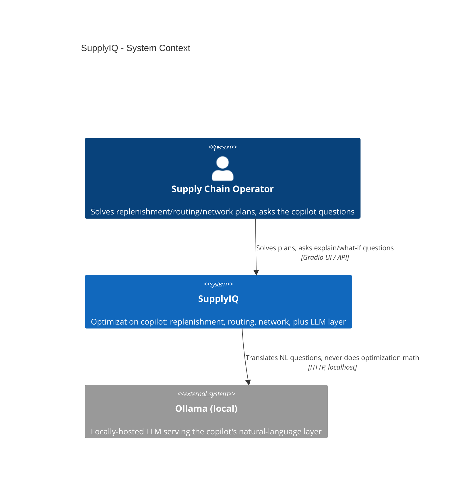
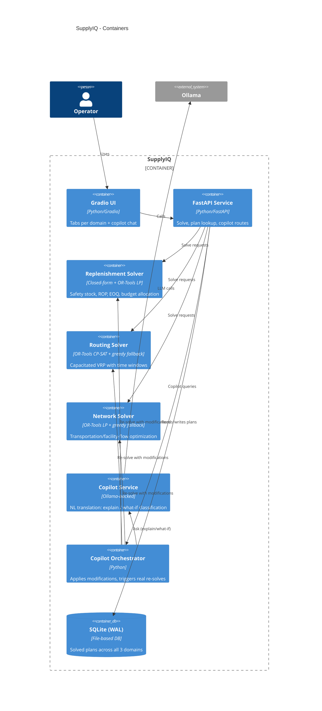
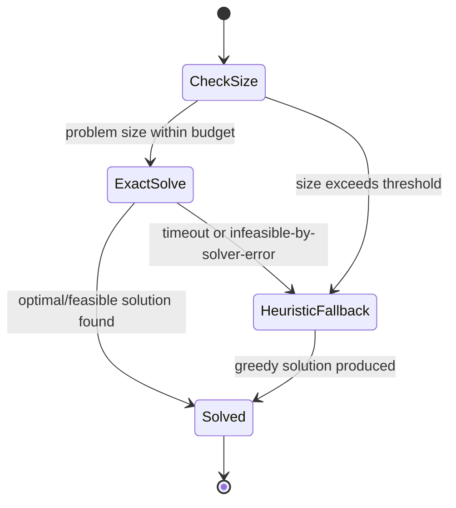
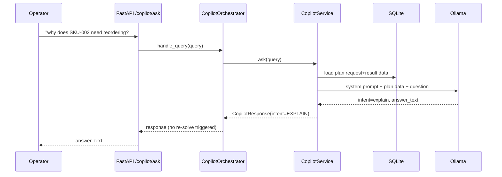
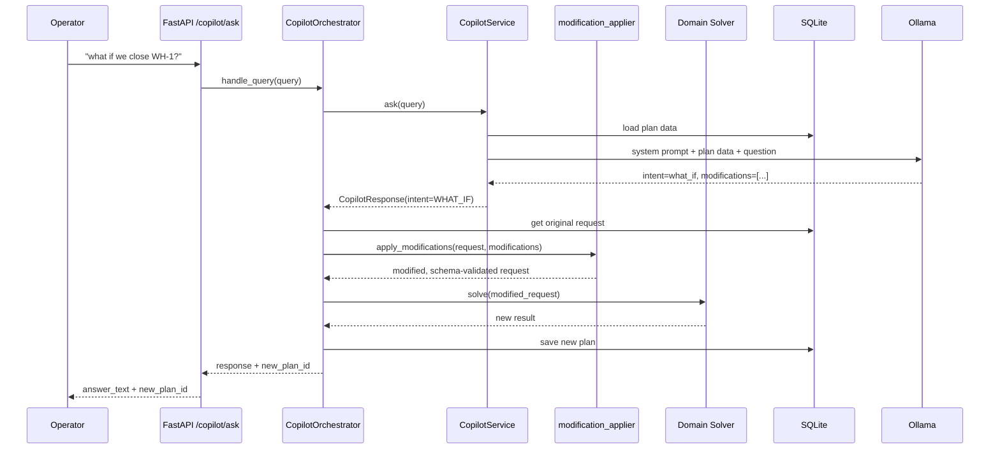
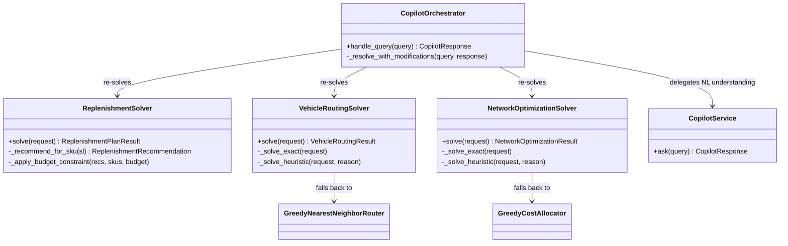

# Architecture Diagrams

## C4 Level 1 - System Context

## C4 Level 2 - Containers

## Exact-vs-Heuristic Decision Flow (shared pattern, ADR-002)

## Copilot Explain Sequence

## Copilot What-If Sequence (real re-solve)

## Domain Model Overview

